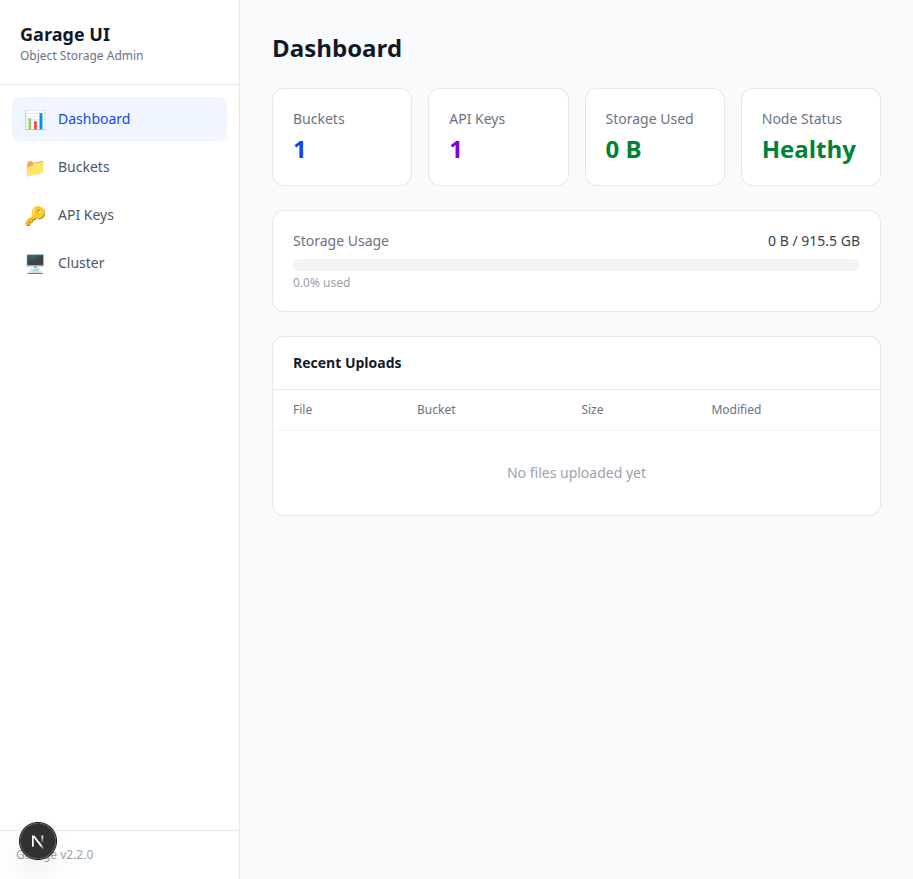

# Garage UI

A lightweight, self-hosted web admin panel for [Garage](https://garagehq.deuxfleurs.fr/) object storage. Built with Next.js, TypeScript, and Tailwind CSS.

Garage is an open-source, S3-compatible distributed object storage system designed for self-hosting. **Garage UI** gives it the web interface it's been missing.


## Features

- **Dashboard** -- Overview of buckets, keys, storage usage, node health, and recent uploads at a glance
- **File Browser** -- Navigate folders, upload files (drag & drop), download, preview images, and bulk delete
- **Bucket Management** -- Create and delete buckets with a one-click provisioning flow that creates a bucket + owner API key together
- **API Key Management** -- Create, delete, and reveal keys. Edit per-bucket permissions (read/write/owner) directly from the UI
- **Cluster Health** -- Monitor node status, storage capacity, version, zone, and replication info
- **Light Theme** -- Clean, minimal interface with sidebar navigation

## Screenshots



## Try it in one command (demo)

Want to see it working *without* setting up Garage first? This repo ships a Docker Compose demo that starts a single-node Garage cluster **and** the UI, fully wired — it applies the cluster layout and creates a demo S3 key + bucket for you:

```bash
docker compose up --build
```

Then open **http://localhost:3000** — the dashboard loads with a ready-to-use bucket and key. Stop with `docker compose down` (add `-v` to also wipe the demo's data).

> The demo uses throwaway credentials on a localhost-only cluster — it's for trying the UI, **not** production. For a real deployment, point the UI at your own Garage cluster using the [Quick Start](#quick-start) below.

## Prerequisites

- [Node.js](https://nodejs.org/) 18+ (22+ recommended)
- A running [Garage](https://garagehq.deuxfleurs.fr/) instance (v2.x)
- Garage Admin API enabled (port 3903 by default)
- An S3 API key with access to your buckets

## Quick Start

```bash
# Clone the repository
git clone https://github.com/your-username/garage-ui.git
cd garage-ui

# Install dependencies
npm install

# Copy the example environment file
cp .env.example .env.local

# Edit .env.local with your Garage connection details
# (see Configuration section below)

# Start the development server
npm run dev
```

Open [http://localhost:3000](http://localhost:3000) in your browser.

> **First run — two things must be true for the dashboard to load:**
> 1. Garage's **Admin API is enabled and reachable** — a `[admin]` block with `admin_token` in `garage.toml`, and `GARAGE_ADMIN_URL` pointing at it (mind Docker/`localhost` and firewalls).
> 2. The **cluster layout is applied** — a brand-new node has `NO ROLE ASSIGNED`, and the API returns `Layout not ready` until you run:
>    ```bash
>    garage layout assign -z <zone> -c <capacity> <node-id>   # e.g. -z dc1 -c 1G
>    garage layout apply --version 1
>    ```
>
> If the dashboard is stuck on **"Loading…"** or shows a connection error, follow **[TROUBLESHOOTING.md](TROUBLESHOOTING.md)** — it walks through the fix in a few steps.

## Configuration

Copy `.env.example` to `.env.local` and fill in your Garage details:

```env
# Garage Admin API
GARAGE_ADMIN_URL=http://localhost:3903
GARAGE_ADMIN_TOKEN=your-admin-token-here

# Garage S3 API
GARAGE_S3_ENDPOINT=http://localhost:3900
GARAGE_S3_ACCESS_KEY=your-access-key-id
GARAGE_S3_SECRET_KEY=your-secret-access-key
GARAGE_S3_REGION=garage
```

### Where to find these values

| Variable | How to get it |
|----------|---------------|
| `GARAGE_ADMIN_URL` | The address of your Garage admin API. Default: `http://localhost:3903`. If Garage runs on a remote host, use that host's IP or set up an SSH tunnel. |
| `GARAGE_ADMIN_TOKEN` | Found in your `garage.toml` under `[admin] admin_token`. |
| `GARAGE_S3_ENDPOINT` | The address of your Garage S3 API. Default: `http://localhost:3900`. |
| `GARAGE_S3_ACCESS_KEY` | Run `garage key list` on your Garage server and pick a key, or create one with `garage key create <name>`. |
| `GARAGE_S3_SECRET_KEY` | Use the Garage Admin API to retrieve it: `curl -H "Authorization: Bearer <admin-token>" http://localhost:3903/v2/GetKeyInfo?id=<key-id>&showSecretKey=true` |
| `GARAGE_S3_REGION` | Usually `garage`. Must match the `s3_region` in your `garage.toml`. |

### Network considerations

Garage's admin API (`port 3903`) often binds to `127.0.0.1` by default, meaning it's only accessible from the machine running Garage. If Garage UI runs on a different machine, you have two options:

1. **SSH tunnel** (recommended):
   ```bash
   ssh -f -N -L 3903:127.0.0.1:3903 -L 3900:127.0.0.1:3900 your-garage-host
   ```
   Then set both URLs to `http://127.0.0.1:<port>` in `.env.local`.

2. **Change Garage config**: Set `api_bind_addr = "0.0.0.0:3903"` in the `[admin]` section of `garage.toml`. Be careful -- this exposes the admin API to your network.

## Architecture

```
Browser  -->  Next.js App  -->  Garage Admin API (port 3903)
                           -->  Garage S3 API (port 3900)
```

All communication with Garage happens through Next.js API routes on the server side. Credentials never reach the browser.

### Tech Stack

- **Next.js 16** (App Router) with TypeScript
- **Tailwind CSS 4** for styling
- **@aws-sdk/client-s3** for S3 operations
- **Garage Admin API v2** for cluster management

### Project Structure

```
src/
  app/
    page.tsx                    # Dashboard
    buckets/
      page.tsx                  # Bucket list + provisioning
      [name]/page.tsx           # File browser
    keys/page.tsx               # API key management
    cluster/page.tsx            # Cluster health
    api/
      admin/                    # Proxy routes to Garage Admin API
        buckets/                # CRUD buckets
        keys/                   # CRUD keys + permissions
        cluster/                # Cluster status
        provision/              # One-click bucket + key creation
      s3/[bucket]/              # Proxy routes to Garage S3 API
        list/                   # List objects
        upload/                 # Upload files
        download/[...key]/      # Download files
        delete/                 # Delete objects
      dashboard/                # Aggregated stats
  components/
    sidebar.tsx                 # Navigation
    stat-card.tsx               # Dashboard stat cards
    storage-gauge.tsx           # Storage usage bar
    file-table.tsx              # File listing with actions
    upload-zone.tsx             # Drag & drop upload
    image-preview.tsx           # Image preview modal
    breadcrumb.tsx              # Folder navigation
    confirm-dialog.tsx          # Delete confirmation
    toast.tsx                   # Toast notifications
  lib/
    garage-admin.ts             # Garage Admin API client
    garage-s3.ts                # S3 client singleton
    utils.ts                    # Formatting helpers
```

## Production Deployment

```bash
# Build for production
npm run build

# Start the production server
npm start
```

You can also deploy behind a reverse proxy (Nginx, Caddy, Traefik) for HTTPS and access control.

### Docker (example)

```dockerfile
FROM node:22-alpine AS builder
WORKDIR /app
COPY package*.json ./
RUN npm ci
COPY . .
RUN npm run build

FROM node:22-alpine AS runner
WORKDIR /app
COPY --from=builder /app/.next/standalone ./
COPY --from=builder /app/.next/static ./.next/static
COPY --from=builder /app/public ./public
EXPOSE 3000
CMD ["node", "server.js"]
```

> Note: To use standalone output, add `output: "standalone"` to your `next.config.ts`.

## Security

- All Garage credentials are stored server-side in `.env.local` and are never exposed to the browser
- No authentication is included by default -- this is intended for single-user, private network use
- If exposing to the internet, put it behind a reverse proxy with authentication (e.g., Authelia, Caddy basic auth, Cloudflare Access)
- The Admin API token has full control over your Garage cluster -- treat it like a root password

## Contributing

Contributions are welcome! Please:

1. Fork the repository
2. Create a feature branch (`git checkout -b feat/my-feature`)
3. Commit your changes
4. Push to the branch
5. Open a Pull Request

## Roadmap

- [ ] Dark mode toggle
- [ ] Bucket policy editor
- [ ] File/folder rename
- [ ] Storage usage graphs over time
- [ ] Multi-node cluster visualization
- [ ] Optional authentication layer
- [ ] Docker image on Docker Hub/GHCR

## License

MIT License. See [LICENSE](LICENSE) for details.

## Acknowledgments

- [Garage](https://garagehq.deuxfleurs.fr/) by Deuxfleurs -- the S3-compatible storage engine this UI is built for
- [Next.js](https://nextjs.org/) by Vercel
- [Tailwind CSS](https://tailwindcss.com/)
